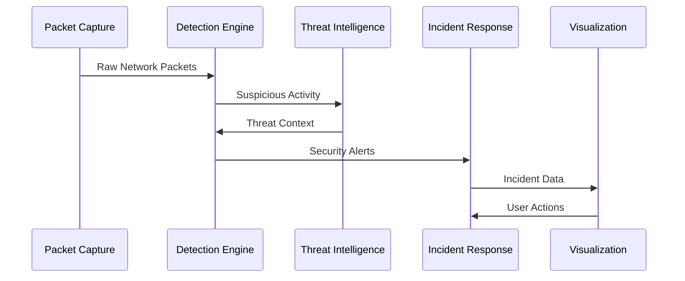

# Architecture Overview

## System Components

### Core Components

#### Packet Capture
- Real-time network traffic monitoring
- Support for multiple network interfaces
- Packet filtering and preprocessing
- High-performance capture engine

#### Detection Engine
- Rule-based detection
- Machine learning anomaly detection
- Pattern matching and signature analysis
- Behavioral analysis integration

#### Threat Intelligence
- Real-time threat feed integration
- ML-based confidence scoring
- Indicator correlation
- Automated threat hunting

#### Incident Response
- Automated response actions
- Alert prioritization
- Incident workflow management
- Integration with security tools

### Advanced Features

#### Machine Learning Components
- Anomaly detection models
- Behavioral pattern analysis
- Threat score prediction
- Automated model updates

#### Forensics Capabilities
- Network packet analysis
- Memory forensics
- Evidence collection
- Chain of custody management

#### Visualization
- Real-time network visualization
- Threat intelligence dashboards
- Alert and incident timelines
- Performance metrics

## Data Flow

## Performance Considerations

### Scalability
- Distributed monitoring support
- Load balancing capabilities
- Horizontal scaling options
- Resource optimization

### High Availability
- Redundant components
- Failover mechanisms
- Data replication
- Backup systems

### Security
- Encrypted communications
- Access control
- Audit logging
- Secure storage

## Integration Points

### External Systems
- SIEM integration
- Threat intelligence platforms
- Security tools and services
- Custom API endpoints

### Data Exchange
- Standard formats (STIX/TAXII)
- REST APIs
- Message queues
- WebSocket streams